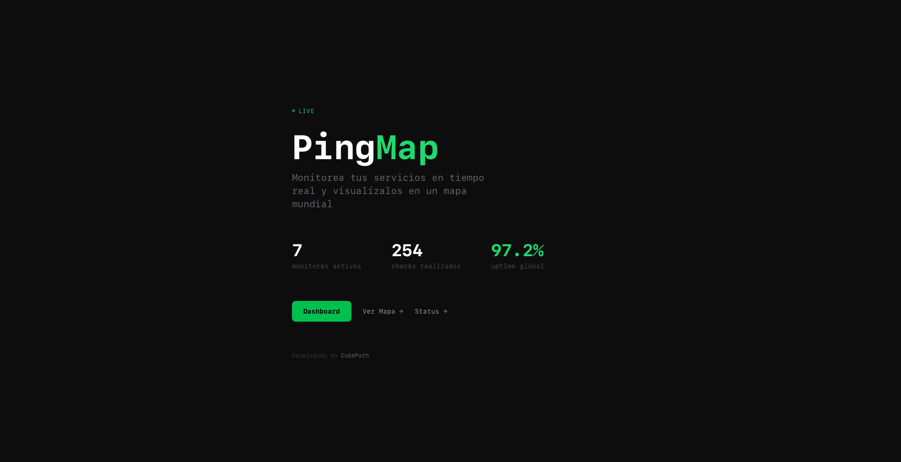
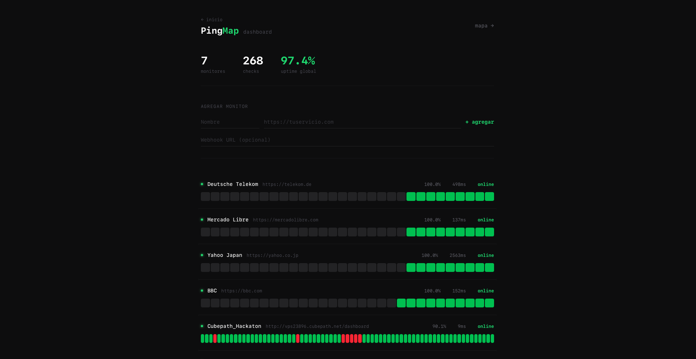
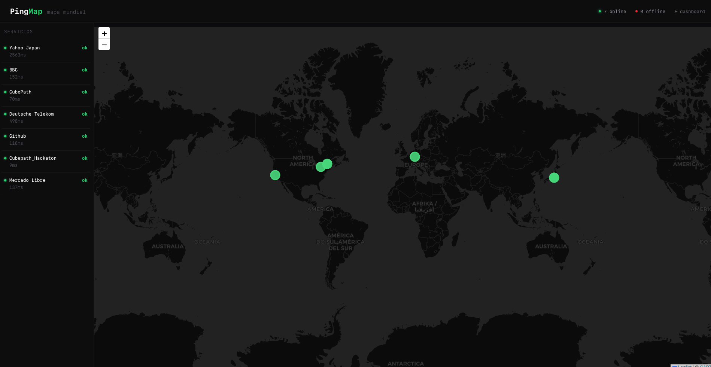
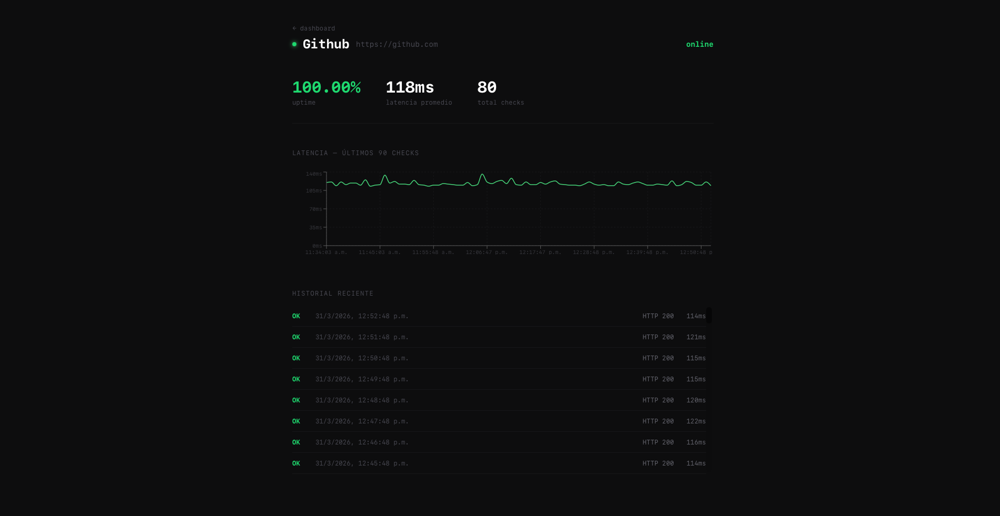
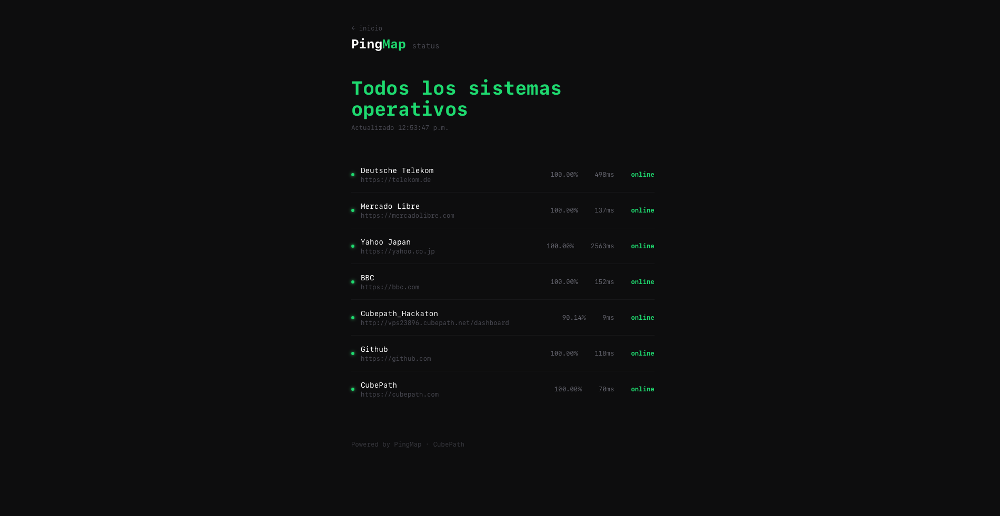

# 🗺️ PingMap

> Monitor de uptime en tiempo real con visualización geográfica mundial

[](https://vps23896.cubepath.net)
[](https://cubepath.com)
[](https://nextjs.org)
[](https://bun.sh)

## 🔗 Demo en vivo

**[https://vps23896.cubepath.net](https://vps23896.cubepath.net)**

---

## 📸 Screenshots







---

## ¿Qué es PingMap?

PingMap nació de la necesidad de tener una herramienta **personal y visual** para monitorear servicios propios en tiempo real. La idea surgió durante un directo de midudev — muchos desarrolladores necesitan saber cuándo sus servicios caen, pero las soluciones existentes son caras o complejas.

PingMap resuelve esto de forma simple: agrega una URL, y el sistema la monitorea cada 60 segundos, registra la latencia, y te avisa via webhook cuando algo falla. Todo visualizado en un mapa mundial con geolocalización real de cada servidor.

## ✨ Features

- 🌍 **Mapa mundial en tiempo real** — geolocalización real de cada servidor via IP
- 📊 **Gráfica de latencia** — historial visual de respuesta por monitor  
- 📋 **Página de status pública** — comparte el estado de tus servicios con tus usuarios
- ⚡ **Métricas en vivo** — latencia promedio, % uptime global y total de checks
- 🔔 **Webhooks de alerta** — notificaciones automáticas cuando un servicio cae o se recupera
- 🔒 **HTTPS** — certificado SSL automático via Let's Encrypt
- 🔄 **Worker independiente** — proceso de pings cada 60 segundos con PM2
- 🌐 **API pública** — endpoints REST para integrar con otros sistemas

## 🛠️ Stack técnico

| Tecnología | Uso |
|-----------|-----|
| Next.js 16 + Bun | Frontend y API routes |
| PostgreSQL | Base de datos de monitores y checks |
| Leaflet + React Leaflet | Mapa mundial interactivo |
| Recharts | Gráficas de latencia |
| ip-api.com | Geolocalización real de servidores |
| PM2 | Gestión de procesos en producción |
| Nginx + Let's Encrypt | Proxy inverso y HTTPS |
| CubePath VPS | Infraestructura de deploy |

## 🚀 Cómo se usó CubePath

PingMap está desplegado en un **VPS gp.nano de CubePath** (Houston, Texas):

- 1 vCPU / 2GB RAM / 40GB SSD NVMe
- Protección AntiDDoS incluida
- Ubuntu 24.04 LTS
- Dominio gratuito: `vps23896.cubepath.net`
- HTTPS con Let's Encrypt automático
- Nginx como proxy inverso al puerto 3000

El proyecto corre dos procesos via PM2 que arrancan automáticamente con el servidor:
1. `pingmap` — servidor Next.js en puerto 3000
2. `pingmap-worker` — worker de pings cada 60 segundos

## 🏃 Correr localmente
```bash
# Requisitos: Bun + Docker
git clone https://github.com/alfonsoHR98/pingmap.git
cd pingmap
bun install
docker compose up -d
cp .env.example .env.local
# Edita DATABASE_URL en .env.local

# Terminal 1 — app
bun run dev

# Terminal 2 — worker de pings
bun run worker
```

## 📁 Estructura
```
pingmap/
├── src/
│   ├── app/
│   │   ├── page.tsx           ← Landing con stats globales
│   │   ├── dashboard/         ← Dashboard de monitores
│   │   ├── map/               ← Mapa mundial con sidebar
│   │   ├── status/            ← Página de status pública
│   │   ├── monitors/[id]/     ← Detalle con gráfica de latencia
│   │   └── api/               ← REST API (monitors, checks, stats, geo)
│   ├── components/
│   │   ├── MapView.tsx        ← Mapa Leaflet con geolocalización real
│   │   └── UptimeBar.tsx      ← Barra de historial de uptime
│   └── lib/
│       ├── db.ts              ← Conexión PostgreSQL
│       ├── pinger.ts          ← Lógica de pings + webhooks
│       ├── geo.ts             ← Geolocalización por IP
│       └── schema.sql         ← Schema de la DB
├── worker.ts                  ← Worker independiente de pings
├── docker-compose.yml         ← PostgreSQL local
└── .env.example               ← Variables de entorno
```

## 👤 Autor

**Alfonso Rojas** — [@alfonsoHR98](https://github.com/alfonsoHR98)

Proyecto creado para la [Hackatón CubePath 2026](https://github.com/midudev/hackaton-cubepath-2026) organizada por [midudev](https://midu.dev).
